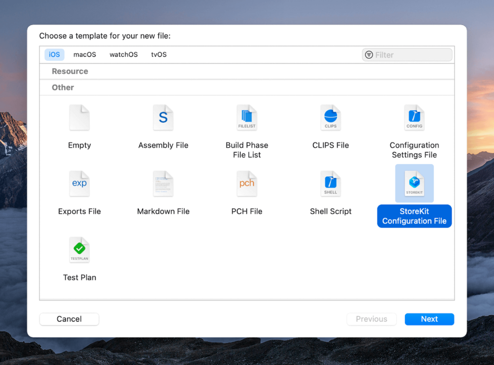
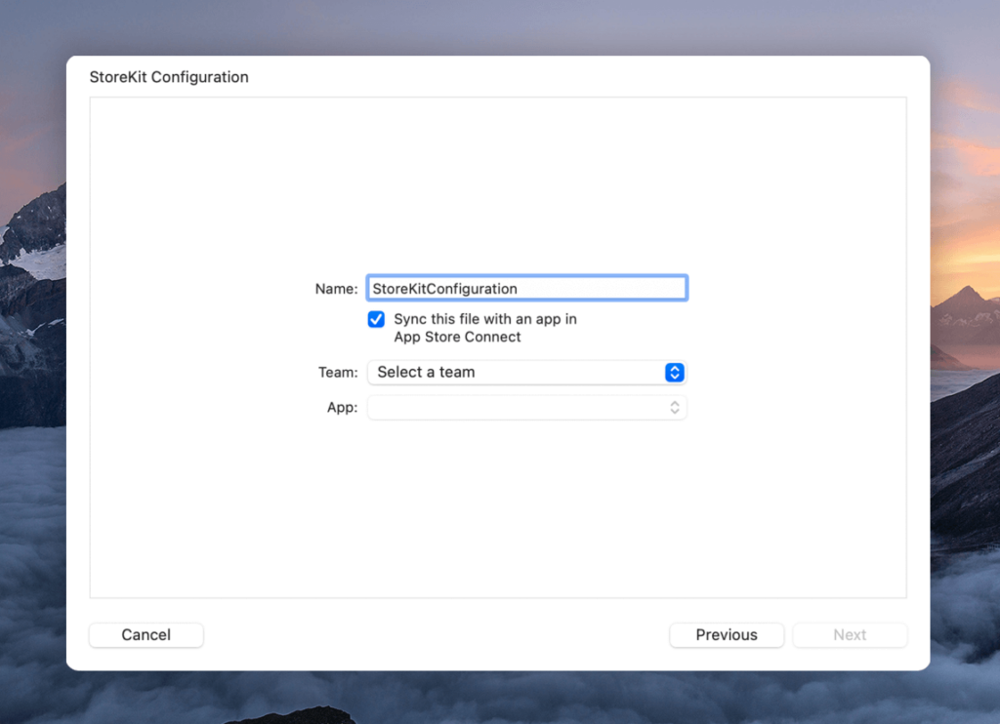
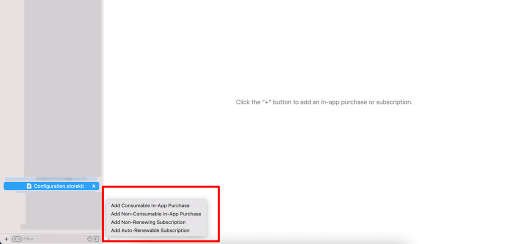
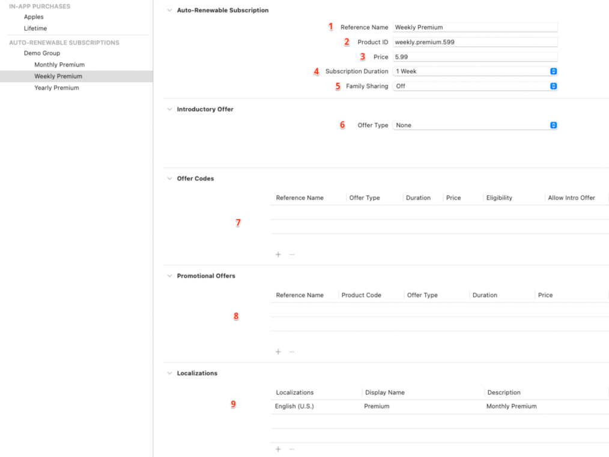
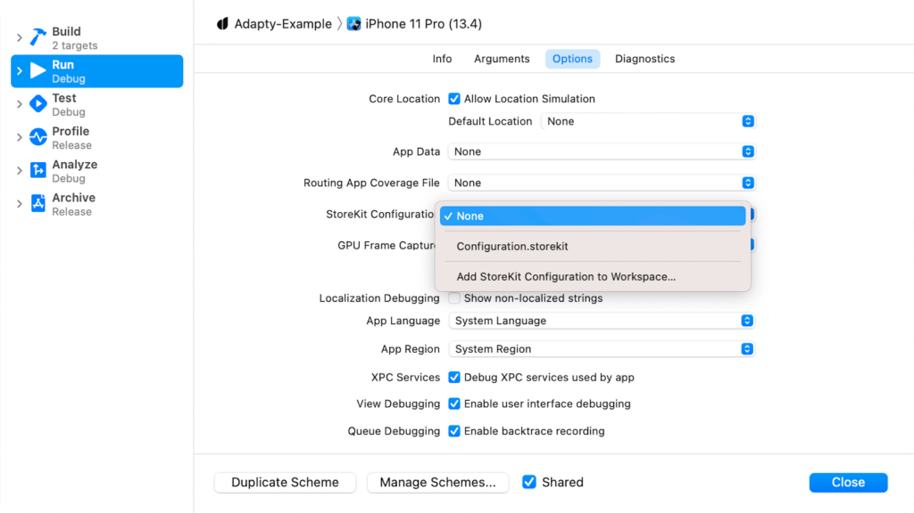
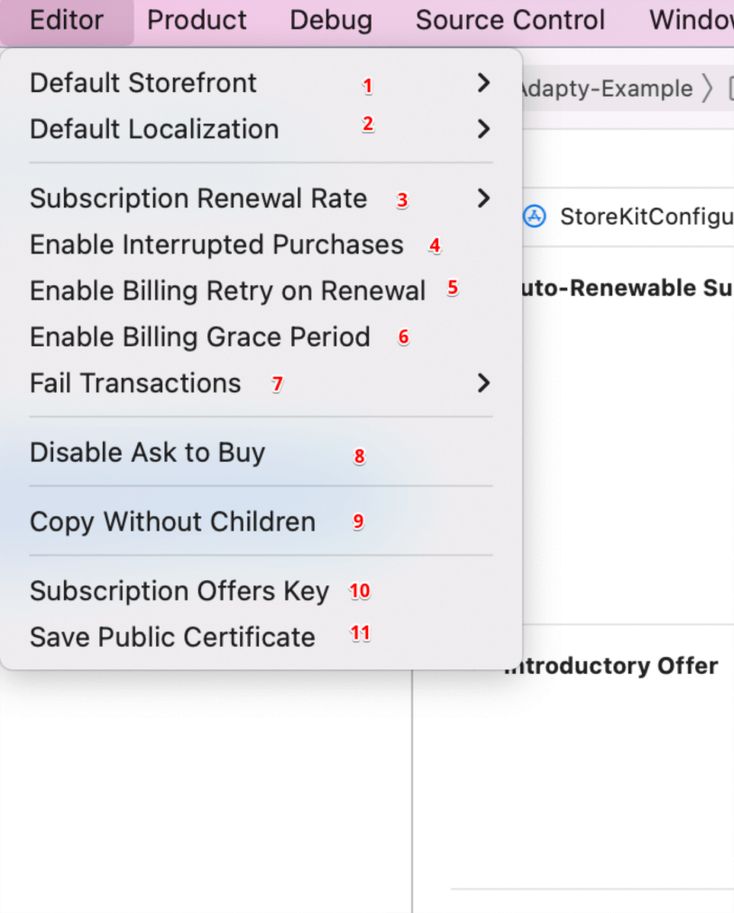
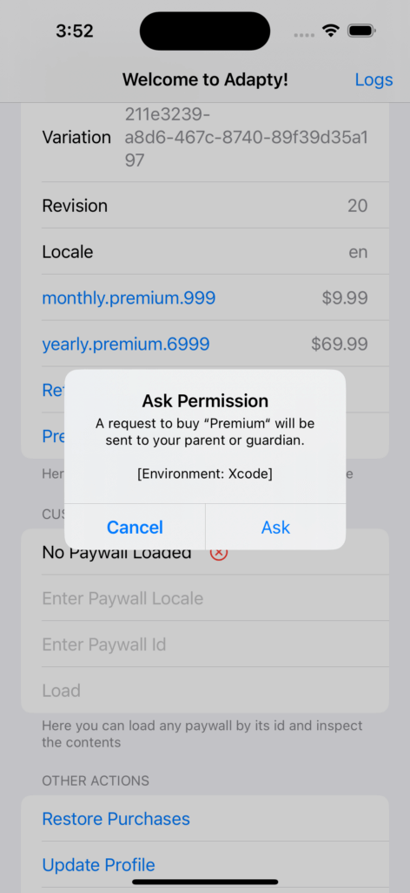
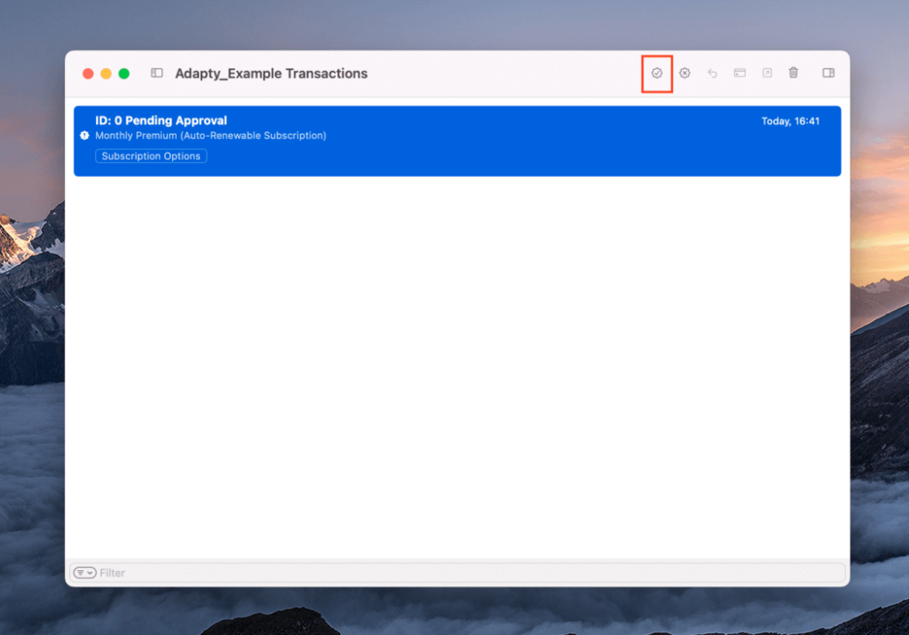
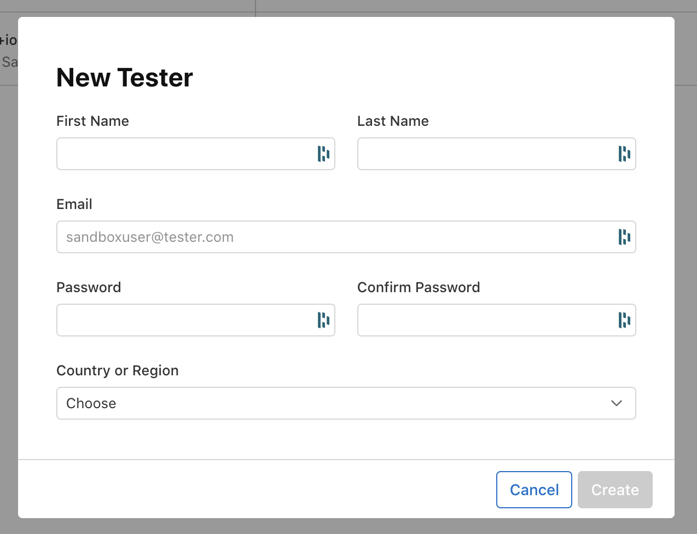
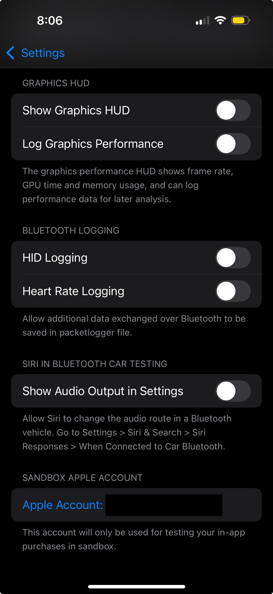

# Testing iOS In-App Purchases: Complete Guide

This guide covers testing iOS in-app purchases and subscriptions using both Sandbox and StoreKit local testing methods.

## Testing Methods Overview

There are two primary testing options for iOS in-app purchases:

### 1. **Sandbox Testing** (Traditional Method)
- Runs only on real devices
- Requires creating Sandbox accounts on App Store Connect
- More tedious setup process
- Required for testing pricing tables with automatic currency conversion
- Uses real App Store receipt validation

### 2. **StoreKit Local Testing** (Recommended for Development)
- Can test in Xcode simulator and device
- No need for Sandbox accounts
- Faster setup and testing process
- Can be automated and used in UI tests
- Works at early development stages (before App Store Connect setup)
- Uses local receipt validation through Xcode

## StoreKit Local Testing Setup

### Step 1: Create StoreKit Configuration File

1. In Xcode, select **File → New → File**
2. Choose **StoreKit Configuration** file template
3. Specify a name (e.g., `Products.storekit`)
4. Save the file



### Step 2: Sync with App Store Connect (Optional)

You can sync the configuration file with your App Store Connect app definition to automatically import your products, or manually add them as described below.



### Step 3: Add Products to Configuration

1. At the bottom of the `.storekit` file, click **"+"**
2. Select the product type you want to test:
   - **Auto-renewable subscriptions**
   - **Non-renewable subscriptions** 
   - **Consumable purchases**
   - **Non-consumable purchases**



#### For Subscriptions:

1. **Create Subscription Group**: Groups multiple subscriptions that provide the same access level
2. **Configure Subscription Details**:
   - **Subscription name**: Display name for internal use
   - **Product ID**: Unique identifier used in your code
   - **Price**: Required field
   - **Subscription duration**: Required (e.g., 1 month, 1 year)
   - **Family sharing**: Enable/disable
   - **Introductory offer**: Optional promotional pricing
   - **Offer codes**: Optional promotional codes
   - **Promotional offers**: Optional upgrade/downgrade offers
   - **Localization**: Title and description for different regions



### Step 4: Enable Local Testing

1. In Xcode, select **Product → Scheme → Edit Scheme**
2. Go to **Run** tab → **Options**
3. Under **StoreKit Configuration**, select your `.storekit` file
4. To disable testing, select "none"



## Testing Scenarios

### Basic Purchase Testing

1. Run your app in Xcode
2. Navigate to your paywall/purchase screen
3. Attempt to purchase a product
4. The system will use your local StoreKit configuration instead of App Store

### Managing Test Transactions

Starting with Xcode 12, you can manage test purchases:

1. Run your application
2. Select **Debug → StoreKit → Manage Transactions**
3. View all test transactions performed locally
4. Delete transactions to re-test them
5. Simulate refunds by right-clicking transactions


### Advanced Testing Settings

Access the **Editor** menu in your StoreKit configuration file for advanced options:



#### 1. **Default Storefront**
- Switch between countries and currencies
- Test international pricing

#### 2. **Default Localization**
- Test different languages for product names and descriptions

#### 3. **Subscription Renewal Rate**
- Accelerate subscription renewals for testing
- Example: Test annual subscription renewal in minutes instead of years

#### 4. **Enable Interrupted Purchases**
- Test purchases requiring additional user action
- Simulate SCA (Strong Customer Authentication) for transactions over €30

#### 5. **Enable Billing Retry on Renewal**
- Test billing retry scenarios for failed auto-renewals

#### 6. **Enable Billing Grace Period**
- Test continued access during payment collection attempts

#### 7. **Fail Transactions**
- Explicitly trigger specific error scenarios

#### 8. **Enable Ask to Buy**
- Test Family Sharing purchase approval flow

#### 9. **Subscription Offers Key**
- Configure promotional offer signing

#### 10. **Save Public Certificate**
- Used for local receipt validation

## Testing "Ask to Buy" / Deferred Purchases

1. Select **Editor → Enable Ask to Buy**
2. Restart your application
3. Attempt a purchase
4. You'll see an alert requesting permission
5. Click **"Ask"** button
6. In transaction history window, find "pending approval" transaction
7. Click approve button to complete the transaction





## Managing Subscriptions and Refunds

### Delete Purchases
- Select transaction in history window
- Press **Delete** key to remove and re-test

### Simulate Refunds
- Right-click on transaction in history window
- Select refund option
- Handle revoked entitlements in your code:

```swift
for status in statuses {
  switch status.state {
    case .revoked:
      if let transaction,
        let revocationDate = transaction.revocationDate {
        handleRevokedEntitlement(for: transaction.productID)
      } 
    case .expired:
      continue
    default:
      // Handle other states
  }
}
```

## Sandbox Testing Setup

### Step 1: Create Sandbox Test Account

1. Go to **App Store Connect**
2. Navigate to **Users and Access → Sandbox Testers**

3. Create a new sandbox tester account with unique email
4. Set country/region and password




### Step 3: Configure Device for Sandbox Testing

**Method 1: Through App Store Settings (Traditional)**
1. On your iOS device, go to **Settings → App Store**
2. **Sign out** of your regular Apple ID
3. Install and run your app
4. When prompted for Apple ID during purchase, use sandbox credentials



**Method 2: Through Developer Menu (Recommended)**
1. With **Developer Mode enabled**, go to **Settings → Developer** 
2. Look for **"StoreKit Sandbox Account"** or **"App Store Sandbox"** section
3. Sign in with your sandbox test account credentials
4. This allows you to test without signing out of your main Apple ID

### Step 4: Test Products

1. Ensure your products are created and **approved** in App Store Connect
2. Bundle ID must match exactly between app and App Store Connect
3. Products must be available in your test region
4. Test with real device (Sandbox doesn't work in simulator)

## Troubleshooting Common Issues

### Products Not Found

1. **Verify Bundle ID**: Must match exactly in App Store Connect
2. **Check Product Status**: Products must be approved in App Store Connect
3. **Region Availability**: Ensure products are available in test region
4. **Sandbox Account**: Verify you're signed in with correct sandbox account

### Debug Logging

Add detailed logging to track issues:

```swift
print("🔍 Requesting product: \(productIdentifier)")
print("📦 Products returned: \(products.count)")
for product in products {
    print("✅ Found product: \(product.id) - \(product.displayName)")
}
```

### StoreKit Configuration Issues

1. **File Not Selected**: Ensure `.storekit` file is selected in scheme options
2. **Product ID Mismatch**: Verify product IDs match between code and configuration
3. **Missing Localization**: Add at least one localization for each product

## Best Practices

### For Development
- Use **StoreKit local testing** for rapid iteration
- Test all purchase flows and edge cases
- Automate testing with UI tests where possible
- Test different subscription durations and offers

### For Pre-Release
- Use **Sandbox testing** to validate real App Store integration
- Test with multiple Sandbox accounts
- Verify receipt validation works correctly
- Test in different regions and currencies

### For Production
- Monitor transaction logs and error rates
- Implement proper error handling for all scenarios
- Use server-side receipt validation
- Handle edge cases like network failures and interrupted purchases

## Additional Resources

- [Apple StoreKit Documentation](https://developer.apple.com/documentation/storekit)
- [App Store Connect Help](https://help.apple.com/app-store-connect/)
- [StoreKit Testing in Xcode](https://developer.apple.com/documentation/xcode/setting-up-storekit-testing-in-xcode)

## Related Articles

This guide is part of a comprehensive series on iOS in-app purchases:

1. App Store Connect and project configuration
2. Initialization and purchase processing  
3. Testing purchases in Xcode (this guide)
4. Server-side receipt validation
5. SKError codes and error handling

---

## Image Credits

All screenshots and images are for educational purposes. Some images adapted from [Adapty's comprehensive testing guide](https://adapty.io/blog/how-to-test-ios-in-app-purchases/).

## Images Status

### ✅ Complete Image Set (13 total)

**🎉 ALL IMAGES INCLUDED! Complete visual testing guide.**

**StoreKit Local Testing (9 images from Adapty blog):**
- ✅ `create-storekit-file.png` - Xcode new file dialog
- ✅ `sync-app-store-connect.png` - App Store Connect sync option
- ✅ `add-products-storekit.png` - Adding products interface
- ✅ `subscription-setup.png` - Subscription configuration form
- ✅ `edit-scheme-storekit.png` - Xcode scheme options
- ✅ `transaction-manager.png` - StoreKit transaction manager
- ✅ `editor-menu-options.png` - StoreKit editor menu
- ✅ `ask-to-buy-flow.png` - Ask to buy permission dialog
- ✅ `pending-approval.png` - Pending transaction approval

**Sandbox Testing (4 images):**
- ✅ `enable_dev_mode_ios.jpg` - Enable iOS Developer Mode (prerequisite)
- ✅ `sandbox-tester-setup.png` - App Store Connect sandbox tester list
- ✅ `sandbox-tester-setup_2.png` - New tester creation form
- ✅ `septup_sandbox_ios.jpg` - iOS device Settings → App Store (traditional method)

See `docs/images/DOWNLOAD_IMAGES.md` for technical details. 
